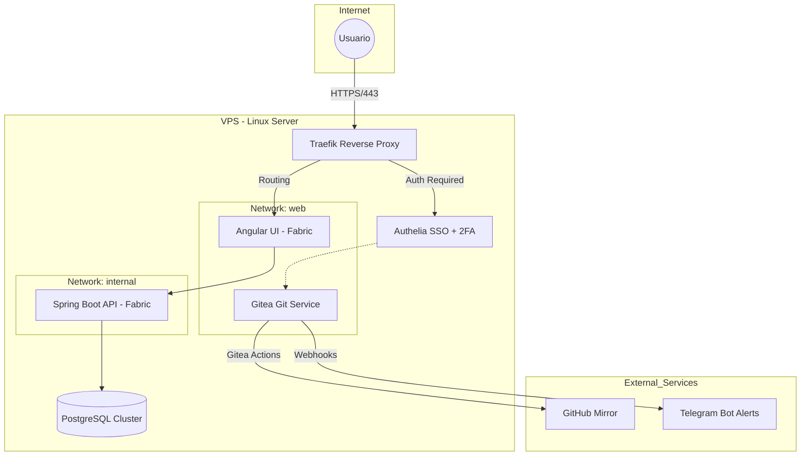

---

# 🌐 My Self-Hosted Cloud Infrastructure

Este repositorio documenta la arquitectura de mi infraestructura privada alojada en un VPS. He diseñado un ecosistema de nube personal basado en **Docker**, centrado en la seguridad, la automatización CI/CD y la alta disponibilidad de servicios.

## 🏗️ Arquitectura del Sistema

La infraestructura utiliza **Traefik** como cerebro central para el enrutamiento y la gestión de certificados SSL. La comunicación entre servicios está aislada mediante redes virtuales de Docker.

---

## 🛠️ Stack Tecnológico

| Componente | Herramienta | Función |
| :--- | :--- | :--- |
| **Edge Router** | **Traefik** | Proxy inverso y certificados SSL automáticos (Let's Encrypt). |
| **Seguridad** | **Authelia** | Single Sign-On (SSO) y autenticación 2FA (Microsoft Authenticator). |
| **VPN** | **Wireguard** | Acceso seguro a la red interna del VPS. |
| **Database** | **PostgreSQL** | Motor de base de datos relacional para múltiples aplicaciones. |
| **Git & CI/CD** | **Gitea + Actions** | Servidor Git privado y ejecución de pipelines de despliegue. |
| **Container Runtime** | **Docker & Compose** | Orquestación de servicios mediante contenedores ligeros. |

---

## 🚀 Flujo de Despliegue (GitOps)

He implementado un ciclo de vida de software automatizado para mis proyectos:

1.  **Desarrollo:** Trabajo local en rama `develop`.
2.  **Integración:** Merge a `main` y push a **Gitea**.
3.  **Pipeline (CI/CD):**
    * Construcción de imagen Docker (Multi-stage build).
    * Push a un **Registry Privado**.
    * Actualización automática del servicio en el VPS via **Docker Compose**.
4.  **Mirroring:** Sincronización automática de la rama `main` hacia **GitHub** para visibilidad pública.
5.  **Monitoreo:** Notificación instantánea del estado del despliegue vía **Telegram Bot**.

---

## 🛡️ Seguridad Implementada

* **Zero Trust Approach:** Uso de Authelia para proteger paneles administrativos (Gitea, Portainer, etc).
* **Aislamiento de Red:** Los contenedores solo exponen los puertos estrictamente necesarios. La base de datos vive en una red `internal` inaccesible desde internet.
* **Firewall Estricto:** Puertos cerrados por defecto (UFW), permitiendo solo tráfico 80, 443 y el túnel de Wireguard.
* **Secrets Management:** Uso de secretos encriptados en las Actions para evitar fugas de credenciales.

---

## 📈 Próximos Pasos

- [ ] Implementar monitoreo con **Prometheus & Grafana**.
- [ ] Configurar copias de seguridad automáticas de los volúmenes de Postgres a S3.
- [ ] Centralización de logs con **Loki**.

---
*Documentado por [Victor Ponce](https://victorponce.dev) — Entusiasta de la Infraestructura y el Self-Hosting.*

---
