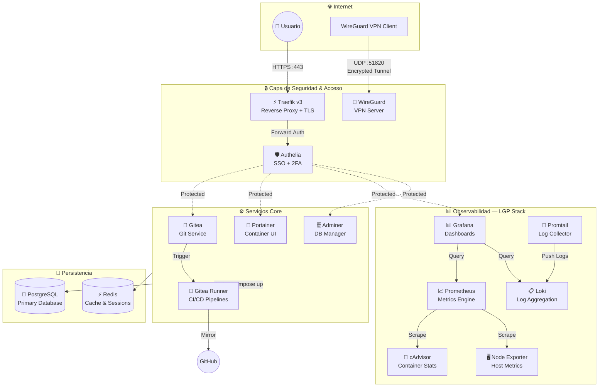

<div align="center">

# 🖥️ VPS Infrastructure — Self-Hosted Cloud Ecosystem

**Arquitectura de nube privada de producción, construida sobre Docker con principios Zero-Trust, observabilidad de grado empresarial y automatización GitOps completa.**

[](https://www.docker.com/)
[](https://traefik.io/)
[](https://grafana.com/)
[](https://gitea.io/)
[](https://www.wireguard.com/)

*Diseñado y mantenido por [Victor Ponce](https://victorponce.dev)*

</div>

---

## 📋 Tabla de Contenidos

- [Visión General](#-visión-general)
- [Arquitectura del Sistema](#️-arquitectura-del-sistema)
- [Stack Tecnológico](#-stack-tecnológico)
  - [Networking & Edge](#1-networking--edge)
  - [Seguridad & Acceso SSO](#2-seguridad--acceso-sso)
  - [Observabilidad — LGP Stack](#3-observabilidad--lgp-stack)
  - [Base de Datos & Persistencia](#4-base-de-datos--persistencia)
  - [Gestión & GitOps](#5-gestión--gitops)
- [Pipeline CI/CD](#-pipeline-cicd)
- [Seguridad & Hardening](#️-seguridad--hardening)
- [Estructura de Redes Docker](#-estructura-de-redes-docker)

---

## 🎯 Visión General

Este repositorio documenta y versiona la infraestructura completa de mi VPS Linux personal. El objetivo ha sido construir un **ecosistema de nube privada autosuficiente** que replique patrones de arquitectura de producción a escala real, incorporando:

- **Zero-Trust Security**: ningún servicio sensible expuesto directamente a internet.
- **Observabilidad 360°**: métricas, logs y alertas centralizados en tiempo real.
- **GitOps Completo**: todo cambio de infraestructura pasa por un pipeline reproducible y versionado.
- **Alta Disponibilidad**: servicios diseñados para reiniciarse y recuperarse de forma autónoma.

> **Nota de diseño:** Cada servicio corre en su propio contenedor Docker aislado, con redes segmentadas y volúmenes persistentes, siguiendo el principio de mínimo privilegio en toda la pila.

---

## 🏗️ Arquitectura del Sistema

El sistema se organiza en **cuatro capas** con responsabilidades claramente definidas:

```
┌─────────────────────────────────────────────────────────┐
│                     INTERNET                            │
│          Usuario HTTPS ──── WireGuard VPN Client        │
└────────────────────┬────────────────┬───────────────────┘
                     │                │
┌────────────────────▼────────────────▼───────────────────┐
│           CAPA DE SEGURIDAD & ACCESO                     │
│    Traefik v3 (Reverse Proxy + TLS)                      │
│    Authelia (SSO + 2FA)                                  │
│    WireGuard (VPN Server)                                │
└────────────────────────────┬────────────────────────────┘
                             │
         ┌───────────────────┼───────────────────┐
         │                   │                   │
┌────────▼────────┐ ┌────────▼────────┐ ┌────────▼────────┐
│  SERVICIOS CORE │ │  OBSERVABILIDAD │ │  PERSISTENCIA   │
│  Gitea + Runner │ │  Prometheus     │ │  PostgreSQL      │
│  Portainer      │ │  Grafana        │ │  Redis Cache     │
│  Adminer        │ │  Loki + Promtail│ │                  │
│                 │ │  cAdvisor       │ │                  │
│                 │ │  Node Exporter  │ │                  │
└─────────────────┘ └─────────────────┘ └─────────────────┘
```

### Diagrama de Flujo de Red (Mermaid)



---

## 🛠️ Stack Tecnológico

### 1. Networking & Edge

| Componente | Versión | Rol |
|---|---|---|
| **Traefik** | v3 | Reverse proxy, TLS termination, load balancer |
| **WireGuard** | Latest | VPN server para acceso interno cifrado |
| **Let's Encrypt** | ACME v2 | Emisión y renovación automática de certificados SSL |

**Traefik v3** actúa como punto de entrada único para todo el tráfico HTTPS entrante. Se integra nativamente con Docker a través de labels de contenedor, descubriendo y configurando rutas de forma automática sin necesidad de reinicios. La resolución de certificados TLS se realiza mediante el protocolo ACME de Let's Encrypt con renovación automática.

**WireGuard** proporciona un túnel VPN de alto rendimiento basado en criptografía moderna (ChaCha20, Poly1305, Curve25519). Todo acceso a herramientas de administración y monitoreo se canaliza a través de este túnel, eliminando la exposición directa a internet de superficies críticas de ataque.

---

### 2. Seguridad & Acceso SSO

| Componente | Función |
|---|---|
| **Authelia** | Identity Provider con SSO y 2FA |
| **TOTP** | Second factor via Microsoft Authenticator |
| **Forward Auth** | Middleware de Traefik que intercepta toda solicitud |

**Authelia** implementa un portal de autenticación centralizado que funciona como middleware de Traefik. Cualquier solicitud a un servicio protegido es interceptada y redirigida al portal de login antes de ser enrutada al destino. Soporta:

- **Single Sign-On (SSO)**: autenticación única que da acceso a todos los servicios protegidos.
- **Autenticación de Dos Factores (2FA)**: via TOTP con Microsoft Authenticator.
- **Políticas por ruta**: posibilidad de definir niveles de protección distintos por dominio o path.
- **Sesiones con TTL configurable**: expiración automática de sesiones inactivas.

Servicios protegidos: `Gitea`, `Portainer`, `Grafana`, `Adminer`.

---

### 3. Observabilidad — LGP Stack

El stack de observabilidad sigue el patrón **LGP (Loki + Grafana + Prometheus)**, proporcionando visibilidad completa de métricas y logs en un único panel centralizado.

```
Métricas:  cAdvisor ──┐
           NodeExp  ──┼──► Prometheus ──► Grafana Dashboards
           Services ──┘

Logs:      Contenedores ──► Promtail ──► Loki ──► Grafana Explore
```

| Componente | Tipo | Datos recolectados |
|---|---|---|
| **Prometheus** | Time-series DB | Métricas numéricas de todo el stack |
| **Grafana** | Visualización | Dashboards, alertas, exploración de datos |
| **Loki** | Log aggregation | Logs centralizados de todos los contenedores |
| **Promtail** | Log agent | Recolección y envío de logs Docker a Loki |
| **cAdvisor** | Container metrics | CPU, RAM, red y disco por contenedor |
| **Node Exporter** | Host metrics | Métricas del sistema operativo del VPS host |

**Capacidades del stack:**
- Correlación de métricas y logs en la misma ventana temporal en Grafana.
- Alertas configuradas sobre umbrales de CPU, memoria y errores en logs.
- Retención configurable de métricas y logs con compresión automática.
- Dashboards pre-construidos para Docker, Linux host y servicios individuales.

---

### 4. Base de Datos & Persistencia

| Motor | Uso | Persistencia |
|---|---|---|
| **PostgreSQL** | Base de datos relacional principal | Volume Docker montado en host |
| **Redis** | Cache en memoria, gestión de sesiones | AOF + RDB snapshots |
| **Adminer** | GUI web de administración | Sin estado (stateless) |

**PostgreSQL** sirve como motor de base de datos para aplicaciones que requieren ACID compliance. Los datos se persisten en un volumen Docker mapeado directamente al filesystem del host para garantizar durabilidad.

**Redis** gestiona la capa de caché de alto rendimiento y el almacenamiento de sesiones de Authelia, aprovechando su modelo in-memory para latencias de submilisegundo. Se configura con persistencia híbrida (AOF + RDB) para sobrevivir reinicios del contenedor.

**Adminer** ofrece una interfaz web ligera para inspección y gestión manual de bases de datos, protegida detrás del portal SSO de Authelia para que nunca quede expuesto a internet sin autenticación.

---

### 5. Gestión & GitOps

| Componente | Rol en el ecosistema |
|---|---|
| **Gitea** | Servidor Git privado y self-hosted |
| **Gitea Runner** | Ejecución nativa de pipelines CI/CD |
| **Portainer** | GUI de gestión de Docker (contenedores, redes, volúmenes) |

**Gitea** reemplaza la dependencia de servicios externos como GitHub para el almacenamiento de código fuente privado. Incluye gestión de organizaciones, pull requests, issues, webhooks y un registry de paquetes integrado.

**Gitea Runner** (equivalente a GitHub Actions self-hosted) ejecuta los pipelines definidos en archivos `.gitea/workflows/*.yml` directamente sobre el VPS, sin latencia de red externa ni limitaciones de minutos de CI gratuitos.

---

## 🚀 Pipeline CI/CD

El flujo de entrega continua está completamente automatizado desde el commit hasta el despliegue en producción:

```
┌──────────┐    ┌──────────┐    ┌──────────────┐    ┌──────────┐    ┌──────────┐
│  1. PUSH │───►│ 2. BUILD │───►│  3. REGISTRY │───►│ 4. DEPLOY│───►│ 5. NOTIFY│
│          │    │          │    │              │    │          │    │          │
│ git push │    │ Docker   │    │ Private      │    │ docker   │    │ Telegram │
│ to Gitea │    │ multi-   │    │ Container    │    │ compose  │    │ Bot      │
│          │    │ stage    │    │ Registry     │    │ up -d    │    │ Alert    │
└──────────┘    └──────────┘    └──────────────┘    └──────────┘    └──────────┘
                                                           │
                                                    ┌──────▼──────┐
                                                    │  6. MIRROR  │
                                                    │  Sync to    │
                                                    │  GitHub     │
                                                    └─────────────┘
```

### Detalle de cada etapa

**1. Push** — El desarrollador hace `git push` a la instancia privada de Gitea. El webhook interno dispara el pipeline de forma inmediata.

**2. Build** — Gitea Runner ejecuta una construcción Docker multi-stage optimizada, separando las fases de dependencias, compilación y runtime para minimizar el tamaño final de la imagen.

**3. Registry** — La imagen construida y taggeada se publica en el Registry Privado del VPS. Solo las imágenes que superan el build son promovidas al registry.

**4. Deploy** — El Runner ejecuta `docker compose pull && docker compose up -d` sobre el stack correspondiente, aplicando el nuevo contenedor sin tiempo de inactividad gracias a la estrategia de recreación con healthchecks.

**5. Mirror** — Las ramas de producción (`main`, `release/*`) se sincronizan automáticamente hacia GitHub mediante el sistema de mirroring de Gitea, manteniendo visibilidad pública del código sin depender de él como fuente de verdad.

**6. Notify** — Un bot de Telegram recibe notificaciones con el estado del pipeline (éxito/fallo), el commit responsable, el tiempo de build y el log de errores si corresponde.

---

## 🛡️ Seguridad & Hardening

### Aislamiento de Redes Docker

La infraestructura utiliza redes Docker segmentadas para implementar el principio de menor privilegio a nivel de red:

```yaml
networks:
  web:          # Traefik ↔ Servicios con dominio público
  internal:     # Comunicación inter-servicios (sin acceso externo)
  monitoring:   # Stack de observabilidad aislado
  database:     # Capa de datos (solo accesible por servicios autorizados)
```

Ningún contenedor tiene acceso a redes que no necesita. Por ejemplo, Adminer solo puede alcanzar la red `database`; los exporters de métricas solo pertenecen a la red `monitoring`.

### Zero Exposure Policy

| Servicio | Accesible desde internet | Método de acceso |
|---|---|---|
| Traefik Dashboard | ❌ No | VPN + SSO |
| Portainer | ❌ No | VPN + SSO |
| Grafana | ❌ No | SSO (Authelia) |
| Adminer | ❌ No | VPN + SSO |
| Prometheus | ❌ No | VPN únicamente |
| Loki | ❌ No | Red interna únicamente |
| Gitea | ✅ Sí (controlado) | HTTPS + SSO |

### Principios de Hardening Aplicados

- **No-root containers**: todos los contenedores se ejecutan con usuarios no-root donde la imagen lo permite, reduciendo el radio de impacto ante una vulnerabilidad de escape de contenedor.
- **Read-only filesystems**: los contenedores que no necesitan escribir en disco se configuran con filesystem de solo lectura.
- **Secrets management**: las credenciales y secrets se inyectan como variables de entorno o Docker secrets, nunca hardcodeadas en imágenes.
- **Healthchecks**: cada servicio define un healthcheck que Docker evalúa periódicamente para detectar y reiniciar contenedores degradados.
- **Resource limits**: definición de límites de CPU y memoria por contenedor para prevenir que un servicio degrade al resto del stack.

---

## 🌐 Estructura de Redes Docker

```
VPS Host
│
├── red: web (bridge)
│   ├── traefik
│   ├── gitea
│   ├── portainer
│   ├── grafana
│   └── adminer
│
├── red: internal (bridge, internal=true)
│   ├── gitea
│   ├── gitea-runner
│   ├── authelia
│   ├── redis
│   └── adminer
│
├── red: monitoring (bridge, internal=true)
│   ├── prometheus
│   ├── grafana
│   ├── loki
│   ├── promtail
│   ├── cadvisor
│   └── node-exporter
│
└── red: database (bridge, internal=true)
    ├── postgresql
    ├── redis
    ├── gitea
    └── adminer
```

> Las redes marcadas como `internal=true` no tienen acceso a internet saliente, garantizando que una brecha en un servicio interno no pueda exfiltrar datos directamente.

---

<div align="center">

**Infraestructura diseñada, implementada y documentada por [Victor Ponce](https://victorponce.dev)**

*Self-hosting · DevOps · Infrastructure as Code*

</div>